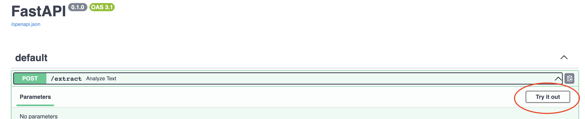

## 1. Pull the Docker Image
To pull the Docker image for the API, open a terminal and run the following command:

```
docker pull paulokewunmi/claim-extraction:1.0.0
```

## 2. Run the Docker Container
To run the API in a Docker container,replace `your_api_key` with api key, and execute the following command:

```
docker run -p 8000:8000 -e OPENAI_API_KEY=your_api_key paulokewunmi/claim-extraction:1.0.0
```

## 3. Test the API
Once the Docker container is running, you can go ahead to test the API.
Make a POST request to http://0.0.0.0:8000/extract with the following parameters:

`file`: Select a text file to upload.

The API will process the text file and return list of claims

Easiest way to test the api is by using the swagger ui found in http://0.0.0.0:8000/docs , then click `Try it out`




Example using curl.
```
curl -X POST -F "file=@../test.txt" http://0.0.0.0:8000/extract

```
{
  "claims": [
    "And I said here, if a report by the Vanguard newspaper is anything to go by, Soldiers deployed around kuje prison who had mastered the terrain were replaced 24 hours before the terrorist invaded the prison.",
    "Why was it 24 hours after troop re-deployment that the terrorists, are there internal collaborators undermining the system?,  remember this, Mallam Tuko Mamu, Media consultant to Islamic cleric Sheikh Hamad gummy says before the attack.",
   
  ]
}
```
